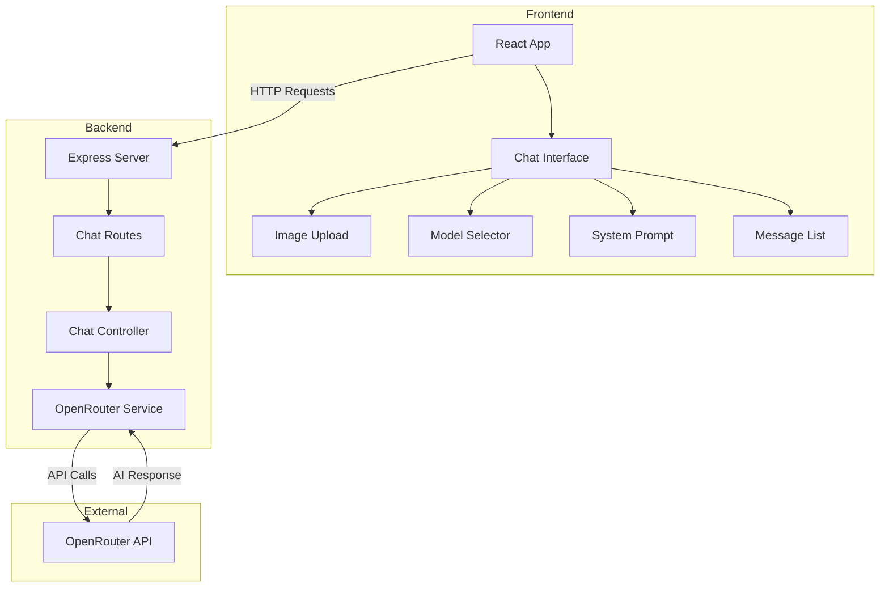
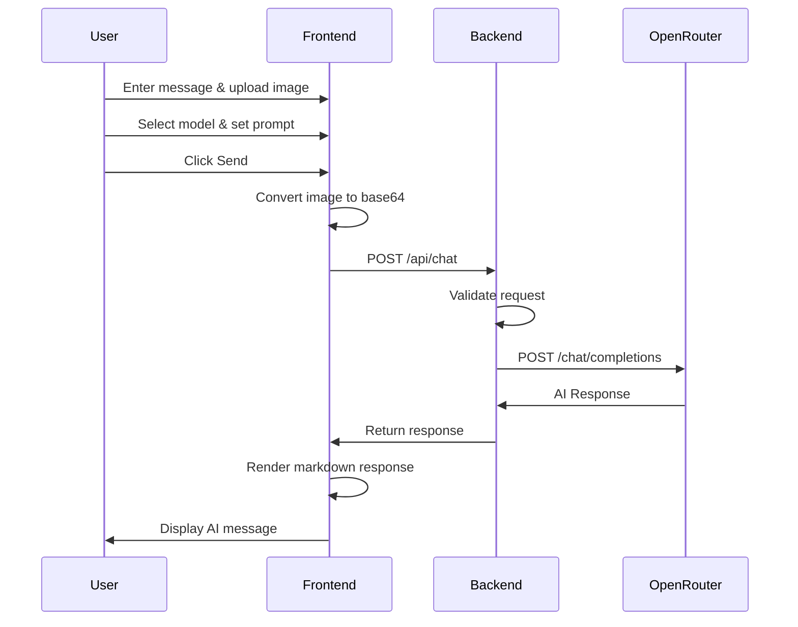

# AI Chat Application Architecture

## Project Overview

A full-stack Node.js application with React frontend that integrates with OpenRouter API to provide AI chat functionality with image upload capabilities, model selection, and custom prompt configuration.

## Technology Stack

### Frontend
- **Framework**: React 18
- **Build Tool**: Vite
- **HTTP Client**: Axios
- **Styling**: CSS3 (or Tailwind CSS)
- **UI Libraries**: 
  - React Markdown (for rendering AI responses)
  - React Icons (for UI icons)

### Backend
- **Runtime**: Node.js
- **Framework**: Express.js
- **Middleware**:
  - CORS (cross-origin resource sharing)
  - express.json (JSON parsing)
  - multer (file upload handling)
- **HTTP Client**: Axios (for OpenRouter API calls)

### External Services
- **AI Provider**: OpenRouter API
- **Authentication**: API Token stored in environment variables

## Project Structure

```
idcardread/
├── backend/
│   ├── src/
│   │   ├── controllers/
│   │   │   └── chatController.js
│   │   ├── routes/
│   │   │   └── chatRoutes.js
│   │   ├── services/
│   │   │   └── openRouterService.js
│   │   ├── middleware/
│   │   │   └── errorHandler.js
│   │   └── app.js
│   ├── .env
│   ├── .env.example
│   ├── package.json
│   └── server.js
├── frontend/
│   ├── src/
│   │   ├── components/
│   │   │   ├── ChatInterface.jsx
│   │   │   ├── MessageList.jsx
│   │   │   ├── MessageInput.jsx
│   │   │   ├── ImageUpload.jsx
│   │   │   ├── ModelSelector.jsx
│   │   │   └── SystemPrompt.jsx
│   │   ├── services/
│   │   │   └── api.js
│   │   ├── App.jsx
│   │   ├── App.css
│   │   └── main.jsx
│   ├── index.html
│   ├── package.json
│   └── vite.config.js
├── README.md
└── .gitignore
```

## System Architecture



## Core Features

### 1. Image Upload & Processing
- **Frontend**: File input with image preview
- **Processing**: Convert image to base64 string
- **Backend**: Receive base64 image data and include in API request
- **Supported Formats**: JPG, PNG, WebP, GIF

### 2. Model Selection
- **Dynamic Model List**: Fetch available models from OpenRouter
- **Vision Models**: Focus on models that support image analysis
- **Default Models**: 
  - `google/gemini-pro-vision`
  - `anthropic/claude-3-opus`
  - `openai/gpt-4-vision-preview`

### 3. Custom System Prompts
- **Purpose**: Allow users to set AI behavior/personality
- **Examples**:
  - "You are a helpful assistant that analyzes images in detail"
  - "You are an expert in OCR and text extraction"
  - "You are a professional photo analyzer"

### 4. Chat Interface
- **Message Display**: Show user messages and AI responses
- **Markdown Support**: Render formatted AI responses
- **Image Display**: Show uploaded images in chat history
- **No Persistence**: Messages cleared on page refresh

## API Endpoints

### Backend REST API

#### 1. POST /api/chat
**Purpose**: Send message to AI with optional image

**Request Body**:
```json
{
  "message": "What's in this image?",
  "image": "data:image/jpeg;base64,/9j/4AAQSkZJRg...",
  "model": "google/gemini-pro-vision",
  "systemPrompt": "You are a helpful assistant"
}
```

**Response**:
```json
{
  "response": "I can see a cat sitting on a chair...",
  "model": "google/gemini-pro-vision",
  "usage": {
    "prompt_tokens": 150,
    "completion_tokens": 75,
    "total_tokens": 225
  }
}
```

#### 2. GET /api/models
**Purpose**: Fetch available models from OpenRouter

**Response**:
```json
{
  "models": [
    {
      "id": "google/gemini-pro-vision",
      "name": "Gemini Pro Vision",
      "description": "Google's multimodal model"
    }
  ]
}
```

### OpenRouter API Integration

**Base URL**: `https://openrouter.ai/api/v1`

**Authentication**: Bearer token in headers

**Key Endpoints Used**:
- `POST /chat/completions` - Send chat requests
- `GET /models` - List available models

## Data Flow

### Chat Message Flow



## Security Considerations

### 1. API Token Protection
- Store OpenRouter token in `.env` file
- Never expose token to frontend
- Use `.gitignore` to exclude `.env` from version control

### 2. Input Validation
- Validate file types (images only)
- Limit file size (e.g., 5MB max)
- Sanitize user input before sending to API

### 3. CORS Configuration
- Allow only specific origins in production
- Configure appropriate headers

### 4. Rate Limiting
- Implement request throttling (optional for MVP)
- Handle API rate limit errors gracefully

## Error Handling

### Frontend
- Display user-friendly error messages
- Handle network errors
- Show loading states during API calls

### Backend
- Catch and log all errors
- Return appropriate HTTP status codes
- Provide meaningful error messages

### Error Scenarios
- Invalid API token
- Network timeout
- Unsupported model
- Image too large
- API rate limit exceeded

## Environment Configuration

### Backend `.env`
```env
OPENROUTER_API_KEY=your_api_key_here
PORT=3001
FRONTEND_URL=http://localhost:5173
```

### Frontend Environment
```javascript
// API base URL configured in service layer
const API_BASE_URL = 'http://localhost:3001/api';
```

## Development Workflow

### 1. Initial Setup
```bash
# Backend setup
cd backend
npm install
cp .env.example .env
# Add your OpenRouter API key to .env

# Frontend setup
cd ../frontend
npm install
```

### 2. Running the Application
```bash
# Terminal 1 - Backend
cd backend
npm run dev

# Terminal 2 - Frontend
cd frontend
npm run dev
```

### 3. Access Points
- Frontend: http://localhost:5173
- Backend: http://localhost:3001

## OpenRouter Integration Details

### Request Format for Vision Models
```javascript
{
  "model": "google/gemini-pro-vision",
  "messages": [
    {
      "role": "system",
      "content": "You are a helpful assistant"
    },
    {
      "role": "user",
      "content": [
        {
          "type": "text",
          "text": "What's in this image?"
        },
        {
          "type": "image_url",
          "image_url": {
            "url": "data:image/jpeg;base64,..."
          }
        }
      ]
    }
  ]
}
```

### Response Format
```javascript
{
  "id": "gen-123",
  "model": "google/gemini-pro-vision",
  "choices": [
    {
      "message": {
        "role": "assistant",
        "content": "I can see..."
      },
      "finish_reason": "stop"
    }
  ],
  "usage": {
    "prompt_tokens": 150,
    "completion_tokens": 75,
    "total_tokens": 225
  }
}
```

## UI/UX Design

### Layout Structure
1. **Header**: App title and model selector
2. **Main Chat Area**: Message history
3. **System Prompt Section**: Expandable textarea
4. **Input Area**: 
   - Image upload button
   - Text input field
   - Send button
5. **Image Preview**: Show uploaded image before sending

### Key UI Components

#### ChatInterface (Main Container)
- Manages application state
- Coordinates child components
- Handles API communication

#### MessageList
- Displays chat history
- Renders user and AI messages
- Shows images in messages

#### ImageUpload
- File input for images
- Image preview
- Clear/remove functionality

#### ModelSelector
- Dropdown of available models
- Shows model descriptions
- Default selection

#### SystemPrompt
- Textarea for custom instructions
- Collapsible/expandable
- Placeholder examples

## Testing Strategy

### Manual Testing Checklist
1. Send text-only message to AI
2. Upload and analyze an image
3. Change AI model and verify response
4. Set custom system prompt and verify behavior
5. Test error scenarios (invalid image, network error)
6. Verify responsive design on different screen sizes

### Test Cases
- ✓ Message sent successfully
- ✓ Image uploaded and displayed
- ✓ Model selection changes API request
- ✓ System prompt affects AI behavior
- ✓ Error messages displayed correctly
- ✓ Loading states shown during API calls

## Deployment Considerations (Future)

### Backend
- Deploy to Heroku, Render, or AWS
- Set environment variables in hosting platform
- Enable HTTPS

### Frontend
- Deploy to Vercel, Netlify, or AWS S3
- Update API URL to production backend
- Enable HTTPS

### Environment Variables
- Production OpenRouter API key
- Production frontend URL for CORS
- Production backend URL

## Future Enhancements

### Phase 2 Features
1. **Conversation History**: Add local storage persistence
2. **Multiple Conversations**: Create new chat threads
3. **Export Chat**: Download conversation as text/JSON
4. **Streaming Responses**: Real-time AI response streaming
5. **File Management**: Support multiple images per message
6. **Model Comparison**: Send same prompt to multiple models

### Phase 3 Features
1. **User Authentication**: Add login/signup
2. **Database Integration**: Store conversations
3. **Advanced Settings**: Temperature, max tokens, etc.
4. **Cost Tracking**: Monitor API usage and costs
5. **Custom Model Training**: Fine-tuned models
6. **Multi-language Support**: Internationalization

## Key Dependencies

### Backend
```json
{
  "express": "^4.18.2",
  "cors": "^2.8.5",
  "dotenv": "^16.3.1",
  "axios": "^1.6.0",
  "multer": "^1.4.5-lts.1"
}
```

### Frontend
```json
{
  "react": "^18.2.0",
  "react-dom": "^18.2.0",
  "axios": "^1.6.0",
  "react-markdown": "^9.0.0"
}
```

## Success Criteria

The project will be considered complete when:
- ✓ User can send text messages to AI and receive responses
- ✓ User can upload images and get AI analysis
- ✓ User can select different AI models
- ✓ User can set custom system prompts
- ✓ All errors are handled gracefully
- ✓ UI is responsive and user-friendly
- ✓ README includes clear setup instructions