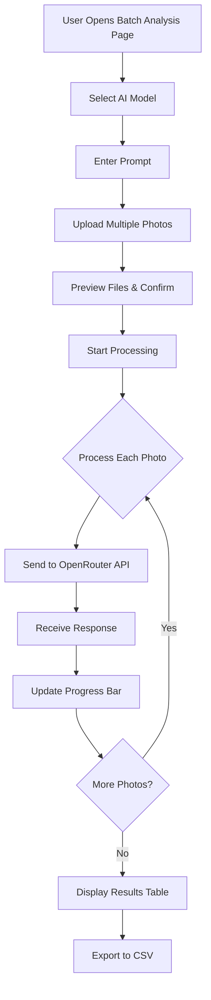

# Batch Photo Analysis Feature - Technical Specification

## Overview
A new feature to upload multiple photos, analyze them using a selected AI model with a custom prompt, and export results to a CSV file with three columns: picture name, prompt request, and AI response.

## Architecture Design

### System Flow Diagram



### Component Architecture

```
Frontend:
├── App.jsx (Updated with routing)
├── components/
│   ├── Navigation.jsx (NEW)
│   ├── ChatInterface.jsx (Existing)
│   └── BatchPhotoAnalysis.jsx (NEW)
│       ├── FileUploader.jsx (NEW)
│       ├── BatchConfigPanel.jsx (NEW)
│       ├── ProgressTracker.jsx (NEW)
│       └── ResultsTable.jsx (NEW)
├── services/
│   ├── api.js (Updated with batch endpoint)
│   └── csvExport.js (NEW)
└── utils/
    └── fileHandler.js (NEW)

Backend:
├── routes/
│   └── chatRoutes.js (Updated with batch endpoint)
├── controllers/
│   └── chatController.js (Updated with batch handler)
└── services/
    └── openRouterService.js (Updated with batch method)
```

## Data Models

### Frontend State
```javascript
{
  selectedPhotos: [
    {
      id: string,              // Unique identifier
      file: File,              // Original file object
      name: string,            // Filename
      preview: string,         // Base64 preview
      size: number,            // File size in bytes
      status: 'pending' | 'processing' | 'completed' | 'error',
      response: string | null, // AI response
      error: string | null     // Error message if failed
    }
  ],
  selectedModel: string,       // Model ID
  prompt: string,              // User prompt
  processing: boolean,         // Overall processing state
  progress: {
    total: number,
    completed: number,
    failed: number
  }
}
```

### API Request/Response

#### Batch Analysis Request
```javascript
POST /api/chat/batch
{
  photos: [
    {
      name: string,
      data: string  // base64 encoded image
    }
  ],
  model: string,
  prompt: string,
  systemPrompt?: string
}
```

#### Batch Analysis Response
```javascript
{
  results: [
    {
      photoName: string,
      prompt: string,
      response: string,
      success: boolean,
      error?: string,
      model: string,
      usage?: {
        prompt_tokens: number,
        completion_tokens: number,
        total_tokens: number
      }
    }
  ],
  summary: {
    total: number,
    successful: number,
    failed: number,
    processingTime: number
  }
}
```

### CSV Export Format
```
Picture Name,Prompt,Response
photo1.jpg,"Describe this image","This image shows..."
photo2.png,"Describe this image","The photograph depicts..."
```

## Technical Implementation

### 1. Frontend Components

#### Navigation Component
- Tab-based navigation between Chat and Batch Analysis
- Active state highlighting
- Responsive design

#### BatchPhotoAnalysis Component
Main container with three sections:
1. **Configuration Panel**
   - Model selector (dropdown)
   - Prompt input (textarea)
   - System prompt (optional, collapsible)
   
2. **File Upload Section**
   - Multi-file drag-and-drop zone
   - File browser button
   - Preview grid with thumbnails
   - Remove individual files option
   - File validation (type, size)
   - Max 20 photos per batch

3. **Results Section**
   - Progress bar with percentage
   - Real-time status updates
   - Results table
   - Export to CSV button

#### FileUploader Component
```javascript
Features:
- Drag & drop support
- Multiple file selection
- Preview thumbnails (grid layout)
- File size validation (5MB per file)
- File type validation (jpg, png, gif, webp)
- Remove files before processing
```

#### ProgressTracker Component
```javascript
Display:
- Overall progress bar
- Current file being processed
- Success/fail counters
- Estimated time remaining
- Processing animation
```

#### ResultsTable Component
```javascript
Features:
- Sortable columns
- Search/filter
- Expandable rows for long responses
- Status indicators (success/error)
- Individual retry for failed items
- Select all/individual for re-export
```

### 2. Backend Implementation

#### Batch Processing Endpoint
```javascript
POST /api/chat/batch

Controller: chatController.processBatch()
Service: openRouterService.processBatch()

Features:
- Parallel processing with concurrency limit (5 concurrent requests)
- Error handling per photo
- Progress tracking
- Timeout handling
- Memory management for large batches
```

#### Processing Strategy
```javascript
// Parallel processing with Promise.allSettled
const processInBatches = async (photos, batchSize = 5) => {
  const results = [];
  for (let i = 0; i < photos.length; i += batchSize) {
    const batch = photos.slice(i, i + batchSize);
    const batchResults = await Promise.allSettled(
      batch.map(photo => processPhoto(photo))
    );
    results.push(...batchResults);
  }
  return results;
};
```

### 3. CSV Export

#### Frontend CSV Generation
```javascript
// Using papaparse library
import Papa from 'papaparse';

const exportToCSV = (results) => {
  const csvData = results.map(result => ({
    'Picture Name': result.photoName,
    'Prompt': result.prompt,
    'Response': result.response
  }));
  
  const csv = Papa.unparse(csvData);
  const blob = new Blob([csv], { type: 'text/csv' });
  const url = window.URL.createObjectURL(blob);
  const link = document.createElement('a');
  link.href = url;
  link.download = `batch-analysis-${Date.now()}.csv`;
  link.click();
};
```

## Dependencies to Add

### Frontend
```json
{
  "react-router-dom": "^6.20.0",
  "papaparse": "^5.4.1",
  "react-dropzone": "^14.2.3" (optional, for better drag-drop)
}
```

### Backend
```json
{
  "fast-csv": "^4.3.6" (optional, for server-side CSV generation)
}
```

## Configuration Updates

### Backend Config
```javascript
batch: {
  maxPhotos: 20,
  maxConcurrent: 5,
  timeout: 120000, // 2 minutes per photo
  maxBatchSize: 50 * 1024 * 1024 // 50MB total
}
```

### Frontend Config
```javascript
batch: {
  maxPhotos: 20,
  maxFileSize: 5 * 1024 * 1024, // 5MB per file
  allowedTypes: ['image/jpeg', 'image/png', 'image/gif', 'image/webp'],
  thumbnailSize: 150 // pixels
}
```

## Error Handling

### Validation Errors
- No photos selected
- Invalid file types
- File size exceeded
- No model selected
- Empty prompt
- Max photos exceeded

### Processing Errors
- API timeout
- Network errors
- Model errors
- Rate limiting
- Invalid API key

### User Feedback
- Toast notifications for quick feedback
- Inline error messages
- Retry options for failed items
- Detailed error logs in results table

## Security Considerations

1. **File Validation**
   - Strict file type checking
   - Size limits enforcement
   - Malicious file detection

2. **Rate Limiting**
   - Limit batch size
   - Throttle API requests
   - Track usage per session

3. **Data Privacy**
   - No server-side storage
   - Temporary processing only
   - Clear data after export

## Performance Optimization

1. **Frontend**
   - Lazy load thumbnail generation
   - Virtual scrolling for large result sets
   - Debounce search/filter
   - Optimize image preview sizes

2. **Backend**
   - Concurrent processing with limits
   - Stream processing for large batches
   - Memory cleanup after processing
   - Connection pooling

## User Experience Flow

1. User navigates to "Batch Analysis" tab
2. Selects AI model from dropdown
3. Enters analysis prompt
4. Uploads multiple photos (drag-drop or browse)
5. Reviews photo previews
6. Clicks "Start Analysis"
7. Watches progress bar and status updates
8. Reviews results in table
9. Exports results to CSV
10. Optionally retries failed items

## Testing Strategy

### Unit Tests
- File validation logic
- CSV generation
- Progress calculation
- Error handling

### Integration Tests
- Batch API endpoint
- Multiple photo processing
- Error recovery
- CSV export accuracy

### E2E Tests
- Complete user flow
- Large batch handling
- Network failure scenarios
- Export functionality

## Future Enhancements

1. **Multi-model batch analysis**
   - Analyze each photo with multiple models
   - Comparison column in CSV

2. **Batch templates**
   - Save prompt templates
   - Reuse configurations

3. **Advanced export options**
   - JSON export
   - Excel format
   - Custom column selection

4. **Progress persistence**
   - Resume interrupted batches
   - Save partial results

5. **Batch history**
   - View previous batches
   - Re-export results

## Timeline Estimate

- Architecture & Planning: Completed
- Frontend routing & navigation: 1-2 hours
- Batch analysis component: 3-4 hours
- Backend batch endpoint: 2-3 hours
- CSV export functionality: 1 hour
- Testing & refinement: 2-3 hours
- Documentation: 1 hour

**Total Estimated Time: 10-15 hours**

## Success Criteria

✅ User can upload multiple photos at once
✅ Photos are analyzed with selected model and prompt
✅ Progress is displayed in real-time
✅ Results are shown in a clear table format
✅ CSV export generates correct format
✅ Error handling for failed photos
✅ Responsive design works on different screen sizes
✅ Performance is acceptable for 20+ photos