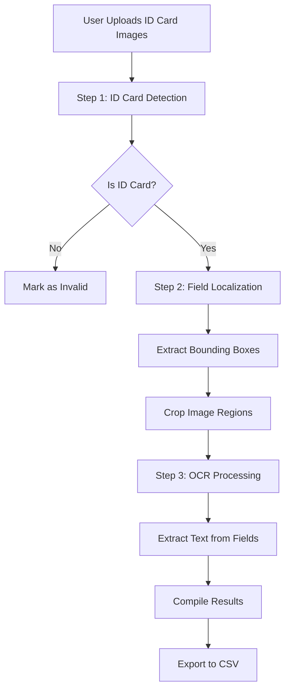
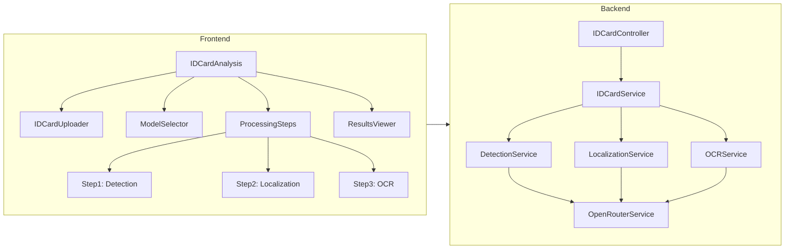

# ID Card Analysis Feature - Architecture & Implementation Plan

## Overview

A sophisticated 3-step AI pipeline for batch processing ID card images with field detection, localization, and OCR capabilities. This feature supports multiple ID card formats with user-selectable AI models for each processing step.

---

## System Architecture

### High-Level Flow



### Component Architecture



---

## 3-Step Processing Pipeline

### Step 1: ID Card Detection

**Purpose**: Verify if the image contains a valid ID card

**Input**:
- Image (base64)
- Detection model ID

**AI Prompt Template**:
```
Analyze this image and determine if it contains an ID card or identification document.

Respond in JSON format:
{
  "isIDCard": boolean,
  "confidence": number (0-100),
  "cardType": "thai_id" | "passport" | "driver_license" | "other" | "none",
  "reasoning": "brief explanation"
}
```

**Output**:
```json
{
  "isIDCard": true,
  "confidence": 95,
  "cardType": "thai_id",
  "reasoning": "Image shows a Thai national ID card with visible text and photo"
}
```

**Success Criteria**: `isIDCard === true` AND `confidence >= 70`

---

### Step 2: Field Localization

**Purpose**: Detect and locate specific fields on the ID card with bounding boxes

**Input**:
- Image (base64)
- Localization model ID
- Card type from Step 1

**AI Prompt Template**:
```
Analyze this {cardType} image and locate the following fields. For each field found, provide bounding box coordinates in the format [ymin, xmin, ymax, xmax] where values are normalized (0.0 to 1.0).

Fields to locate:
1. Identification Number
2. Thai Title (if applicable)
3. Thai First Name (if applicable)
4. Thai Last Name (if applicable)
5. English Title
6. English First Name
7. English Last Name
8. Date of Birth (English format)
9. Date of Birth (Thai format, if applicable)

Respond in JSON format:
{
  "fields": {
    "identityNumber": {"bbox": [ymin, xmin, ymax, xmax], "confidence": number},
    "titleTh": {"bbox": [ymin, xmin, ymax, xmax], "confidence": number},
    "firstNameTh": {"bbox": [ymin, xmin, ymax, xmax], "confidence": number},
    "lastNameTh": {"bbox": [ymin, xmin, ymax, xmax], "confidence": number},
    "titleEn": {"bbox": [ymin, xmin, ymax, xmax], "confidence": number},
    "firstNameEn": {"bbox": [ymin, xmin, ymax, xmax], "confidence": number},
    "lastNameEn": {"bbox": [ymin, xmin, ymax, xmax], "confidence": number},
    "dateOfBirthEn": {"bbox": [ymin, xmin, ymax, xmax], "confidence": number},
    "dateOfBirthTh": {"bbox": [ymin, xmin, ymax, xmax], "confidence": number}
  }
}

Note: If a field is not found or not applicable, set bbox to null and confidence to 0.
```

**Output Example**:
```json
{
  "fields": {
    "identityNumber": {
      "bbox": [0.45, 0.15, 0.52, 0.85],
      "confidence": 92
    },
    "titleEn": {
      "bbox": [0.25, 0.15, 0.30, 0.35],
      "confidence": 88
    },
    "firstNameEn": {
      "bbox": [0.25, 0.38, 0.30, 0.70],
      "confidence": 90
    }
  }
}
```

**Processing**:
1. Receive bounding boxes
2. Validate coordinates (must be between 0.0 and 1.0)
3. Crop image regions based on bounding boxes
4. Store cropped images for Step 3

---

### Step 3: OCR (Text Extraction)

**Purpose**: Extract text from each cropped field region

**Input**:
- Cropped image regions (base64)
- OCR model ID
- Field name

**AI Prompt Template** (for each field):
```
Extract the text from this image which shows a {fieldName} from an ID card.

Respond in JSON format:
{
  "text": "extracted text",
  "confidence": number (0-100)
}

Rules:
- Return only the visible text
- Preserve spacing and formatting
- If text is unclear or not visible, set confidence below 50
- Remove any watermarks or noise
```

**Output Example** (per field):
```json
{
  "text": "John",
  "confidence": 95
}
```

**Batch Processing**:
- Process all fields concurrently (with concurrency limit)
- Compile results into final structure

---

## Data Structures

### Frontend State

```typescript
interface IDCardAnalysisState {
  // File management
  photos: IDCardPhoto[];
  
  // Model selection
  detectionModel: string;
  localizationModel: string;
  ocrModel: string;
  
  // Processing state
  currentStep: 1 | 2 | 3 | 'complete';
  processing: boolean;
  progress: {
    total: number;
    step1Complete: number;
    step2Complete: number;
    step3Complete: number;
    failed: number;
  };
  
  // Results
  results: IDCardResult[];
  errors: ProcessingError[];
}

interface IDCardPhoto {
  id: string;
  file: File;
  name: string;
  preview: string; // base64
  status: 'pending' | 'step1' | 'step2' | 'step3' | 'complete' | 'error';
  
  // Step 1 results
  detectionResult?: {
    isIDCard: boolean;
    confidence: number;
    cardType: string;
  };
  
  // Step 2 results
  localizationResult?: {
    fields: Record<string, FieldLocation>;
    croppedImages: Record<string, string>; // field -> base64
  };
  
  // Step 3 results
  ocrResult?: {
    fields: Record<string, FieldText>;
  };
  
  error?: string;
}

interface FieldLocation {
  bbox: [number, number, number, number]; // [ymin, xmin, ymax, xmax]
  confidence: number;
}

interface FieldText {
  text: string;
  confidence: number;
}

interface IDCardResult {
  imageName: string;
  idcardConfidentailPercent: number;
  titleEn: string;
  titleEnConfidentailPercent: number;
  titleTh: string;
  titleThConfidentailPercent: number;
  firstNameEn: string;
  firstNameEnConfidentailPercent: number;
  firstNameTh: string;
  firstNameThConfidentailPercent: number;
  lastNameEn: string;
  lastNameEnConfidentailPercent: number;
  lastNameTh: string;
  lastNameThConfidentailPercent: number;
  identityNumber: string;
  identityNumberConfidentailPercent: number;
  dateOfBirth: string;
  dateOfBirthConfidentailPercent: number;
}
```

### Backend API Structures

```typescript
// POST /api/idcard/process
interface IDCardProcessRequest {
  photos: Array<{
    name: string;
    data: string; // base64
  }>;
  models: {
    detection: string;
    localization: string;
    ocr: string;
  };
}

interface IDCardProcessResponse {
  results: IDCardResult[];
  summary: {
    total: number;
    successful: number;
    failed: number;
    processingTime: number;
  };
  errors: Array<{
    photoName: string;
    step: number;
    error: string;
  }>;
}
```

---

## Backend Implementation

### New Files Structure

```
backend/src/
├── controllers/
│   └── idCardController.js          (NEW)
├── services/
│   ├── idCardService.js             (NEW)
│   ├── imageProcessingService.js     (NEW)
│   └── openRouterService.js         (UPDATE)
├── routes/
│   └── idCardRoutes.js              (NEW)
└── utils/
    └── imageUtils.js                 (NEW)
```

### Key Services

#### 1. idCardService.js

```javascript
class IDCardService {
  async processIDCards(photos, models) {
    const results = [];
    
    for (const photo of photos) {
      try {
        // Step 1: Detection
        const detection = await this.detectIDCard(photo.data, models.detection);
        
        if (!detection.isIDCard || detection.confidence < 70) {
          results.push({
            photoName: photo.name,
            success: false,
            error: 'Not a valid ID card'
          });
          continue;
        }
        
        // Step 2: Localization
        const localization = await this.localizeFields(
          photo.data, 
          models.localization,
          detection.cardType
        );
        
        // Step 3: Crop and OCR
        const croppedImages = await this.cropFieldsFromImage(
          photo.data, 
          localization.fields
        );
        
        const ocrResults = await this.extractTextFromFields(
          croppedImages,
          models.ocr
        );
        
        // Compile final result
        results.push({
          photoName: photo.name,
          success: true,
          ...this.formatResult(detection, ocrResults)
        });
        
      } catch (error) {
        results.push({
          photoName: photo.name,
          success: false,
          error: error.message
        });
      }
    }
    
    return results;
  }
  
  async detectIDCard(imageData, model) {
    // Call AI model for detection
  }
  
  async localizeFields(imageData, model, cardType) {
    // Call AI model for field localization
  }
  
  async cropFieldsFromImage(imageData, fields) {
    // Use imageProcessingService to crop regions
  }
  
  async extractTextFromFields(croppedImages, model) {
    // Call AI model for each cropped region
  }
}
```

#### 2. imageProcessingService.js

```javascript
class ImageProcessingService {
  cropImageRegion(base64Image, bbox) {
    // Convert base64 to buffer
    // Crop using bbox coordinates
    // Return cropped base64
  }
  
  normalizeCoordinates(bbox, imageWidth, imageHeight) {
    // Convert normalized coords to pixel coords
  }
}
```

---

## Frontend Implementation

### New Components Structure

```
frontend/src/components/
├── IDCardAnalysis/
│   ├── IDCardAnalysis.jsx           (NEW - Main container)
│   ├── IDCardAnalysis.css
│   ├── IDCardUploader.jsx           (NEW - File upload)
│   ├── IDCardUploader.css
│   ├── ModelSelectorTriple.jsx      (NEW - 3 model selectors)
│   ├── ModelSelectorTriple.css
│   ├── ProcessingSteps.jsx          (NEW - Step indicator)
│   ├── ProcessingSteps.css
│   ├── IDCardProgressTracker.jsx    (NEW - Progress display)
│   ├── IDCardProgressTracker.css
│   ├── IDCardResultsTable.jsx       (NEW - Results with all columns)
│   └── IDCardResultsTable.css
```

### Key Components

#### IDCardAnalysis.jsx (Main Component)

```jsx
function IDCardAnalysis() {
  const [photos, setPhotos] = useState([]);
  const [models, setModels] = useState({
    detection: '',
    localization: '',
    ocr: ''
  });
  const [processing, setProcessing] = useState(false);
  const [currentStep, setCurrentStep] = useState(1);
  const [results, setResults] = useState([]);
  
  const handleStartProcessing = async () => {
    setProcessing(true);
    setCurrentStep(1);
    
    try {
      const response = await processIDCards(photos, models);
      setResults(response.results);
      setCurrentStep('complete');
    } catch (error) {
      // Handle error
    } finally {
      setProcessing(false);
    }
  };
  
  return (
    <div className="idcard-analysis">
      <h2>🪪 ID Card Analysis</h2>
      
      <ModelSelectorTriple 
        models={models}
        onChange={setModels}
      />
      
      <IDCardUploader 
        photos={photos}
        onPhotosChange={setPhotos}
      />
      
      <ProcessingSteps 
        currentStep={currentStep}
        processing={processing}
      />
      
      <button onClick={handleStartProcessing}>
        Start Processing
      </button>
      
      {results.length > 0 && (
        <IDCardResultsTable results={results} />
      )}
    </div>
  );
}
```

---

## CSV Export Format

### Column Structure

```csv
imageName,idcardConfidentailPercent,titleEn,titleEnConfidentailPercent,titleTh,titleThConfidentailPercent,firstNameEn,firstNameEnConfidentailPercent,firstNameTh,firstNameThConfidentailPercent,lastNameEn,lastNameEnConfidentailPercent,lastNameTh,lastNameThConfidentailPercent,identityNumber,identityNumberConfidentailPercent,dateOfBirth,dateOfBirthConfidentailPercent
```

### Example Data

```csv
id_card_001.jpg,95,Mr.,88,นาย,92,John,90,จอห์น,87,Smith,91,สมิธ,89,1234567890123,94,1990-05-15,93
id_card_002.jpg,92,Ms.,85,นางสาว,88,Jane,89,เจน,86,Doe,90,โด,87,9876543210987,91,1985-08-22,90
```

---

## API Endpoints

### New Endpoints

#### 1. Process ID Cards (Batch)

```
POST /api/idcard/process
```

**Request**:
```json
{
  "photos": [
    {
      "name": "id_001.jpg",
      "data": "data:image/jpeg;base64,..."
    }
  ],
  "models": {
    "detection": "google/gemini-pro-vision",
    "localization": "anthropic/claude-3-opus",
    "ocr": "openai/gpt-4-vision-preview"
  }
}
```

**Response**:
```json
{
  "results": [
    {
      "imageName": "id_001.jpg",
      "idcardConfidentailPercent": 95,
      "titleEn": "Mr.",
      "titleEnConfidentailPercent": 88,
      ...
    }
  ],
  "summary": {
    "total": 1,
    "successful": 1,
    "failed": 0,
    "processingTime": 12500
  }
}
```

#### 2. Get Recommended Models

```
GET /api/idcard/recommended-models
```

**Response**:
```json
{
  "detection": ["google/gemini-pro-vision", "anthropic/claude-3-opus"],
  "localization": ["anthropic/claude-3-opus", "openai/gpt-4-vision-preview"],
  "ocr": ["google/gemini-pro-vision", "anthropic/claude-3-sonnet"]
}
```

---

## Error Handling Strategy

### Error Types

1. **Detection Failures**
   - Not an ID card
   - Low confidence
   - Action: Skip to next image, mark as invalid

2. **Localization Failures**
   - Invalid bounding boxes
   - No fields detected
   - Action: Retry with alternative model or skip

3. **OCR Failures**
   - Text extraction failed
   - Low confidence
   - Action: Mark field as empty with 0% confidence

4. **Network/API Failures**
   - Timeout
   - Rate limiting
   - Action: Retry with exponential backoff

### Retry Mechanism

```javascript
async function processWithRetry(fn, maxRetries = 3) {
  for (let i = 0; i < maxRetries; i++) {
    try {
      return await fn();
    } catch (error) {
      if (i === maxRetries - 1) throw error;
      await delay(Math.pow(2, i) * 1000);
    }
  }
}
```

---

## Performance Optimizations

### 1. Concurrent Processing

- Step 1: Process in batches of 5 photos
- Step 3: Process all fields concurrently (max 10 concurrent)

### 2. Caching

- Cache cropped images in memory during processing
- Clear cache after results are compiled

### 3. Image Optimization

- Resize images before sending to avoid large payloads
- Use JPEG compression for cropped regions

### 4. Progressive Results

- Return results as each photo completes
- Allow partial CSV export

---

## Testing Strategy

### Unit Tests

- [ ] Image cropping utility
- [ ] Bounding box validation
- [ ] Coordinate normalization
- [ ] CSV formatting

### Integration Tests

- [ ] End-to-end ID card processing
- [ ] Multi-step pipeline flow
- [ ] Error handling scenarios
- [ ] Model switching

### Manual Testing Checklist

- [ ] Upload single Thai ID card
- [ ] Upload multiple ID cards (10+)
- [ ] Test with non-ID images
- [ ] Test with different models
- [ ] Test error scenarios
- [ ] Export CSV with all columns
- [ ] Verify confidence percentages

---

## Implementation Phases

### Phase 1: Backend Foundation (2-3 days)
1. Create ID card service layer
2. Implement 3-step processing pipeline
3. Add image cropping utilities
4. Create API endpoints
5. Test with sample ID cards

### Phase 2: Frontend Components (2-3 days)
1. Create ID Card Analysis main component
2. Build triple model selector
3. Add file uploader
4. Implement step indicator
5. Create results table with all columns

### Phase 3: Integration & Testing (1-2 days)
1. Connect frontend to backend
2. Implement CSV export
3. Add error handling
4. Test with real ID cards
5. Performance optimization

### Phase 4: Polish & Documentation (1 day)
1. UI/UX improvements
2. Add loading states
3. Write user guide
4. Update README
5. Add inline documentation

**Total Estimated Time**: 6-9 days

---

## AI Model Recommendations

### Step 1: Detection
- **Primary**: `google/gemini-pro-vision` (Fast, accurate for classification)
- **Alternative**: `anthropic/claude-3-haiku` (Cost-effective)

### Step 2: Localization
- **Primary**: `anthropic/claude-3-opus` (Excellent spatial understanding)
- **Alternative**: `openai/gpt-4-vision-preview` (Good JSON output)

### Step 3: OCR
- **Primary**: `google/gemini-pro-vision` (Strong OCR capabilities)
- **Alternative**: `anthropic/claude-3-sonnet` (Balanced performance/cost)

---

## Security Considerations

1. **Data Privacy**
   - ID card images contain PII
   - Don't log image data
   - Clear from memory after processing

2. **Input Validation**
   - Validate image formats
   - Check file sizes
   - Sanitize filenames

3. **Rate Limiting**
   - Limit batch size to prevent abuse
   - Implement per-user quotas

4. **Error Messages**
   - Don't expose internal errors
   - Provide user-friendly messages

---

## Future Enhancements

1. **Real-time Processing**
   - WebSocket for live progress updates
   - Streaming results as they complete

2. **Multiple ID Card Types**
   - Passport support
   - Driver's license support
   - International ID cards

3. **Quality Checks**
   - Image blur detection
   - Orientation correction
   - Auto-crop ID card region

4. **Advanced Features**
   - Field validation (date formats, ID number checksums)
   - Duplicate detection
   - Batch comparison tools

---

## Conclusion

This architecture provides a robust, scalable solution for ID card batch processing with:

✅ **3-step AI pipeline** for accurate field extraction  
✅ **User-selectable models** for flexibility  
✅ **Comprehensive error handling** for reliability  
✅ **CSV export** with all required fields  
✅ **Modular design** for easy maintenance  

The implementation follows best practices and leverages your existing batch analysis infrastructure while adding specialized ID card processing capabilities.