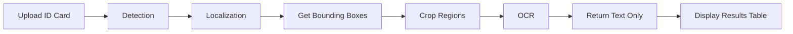
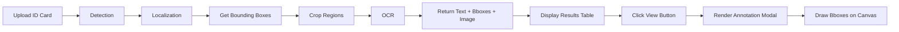

# ID Card Bounding Box Visualization Feature - Implementation Plan

## Overview

Add visual bounding box annotations to ID card analysis results, allowing users to verify that AI correctly detected and localized fields (name, ID number, date of birth, etc.) by displaying colored rectangles around each field on the original image.

## Feature Requirements

### User Story
As a user processing ID cards, I want to see visual bounding boxes on the ID card image showing where each field was detected, so I can verify the AI is correctly identifying field locations and troubleshoot low-confidence results.

### Key Features
- ✅ View annotated ID card images with bounding boxes
- ✅ Color-coded boxes for different field types
- ✅ Field labels with confidence percentages
- ✅ Modal popup for detailed view
- ✅ Hover interactions for field details
- ✅ Keyboard navigation support

---

## System Architecture Changes

### Current Data Flow


### New Data Flow with Visualization


---

## Data Structure Modifications

### Backend Response Enhancement

**Current Response** (missing bbox data):
```javascript
{
  imageName: "id_card_001.jpg",
  idcardConfidentailPercent: 95,
  titleEn: "Mr.",
  titleEnConfidentailPercent: 88,
  // ... other fields
}
```

**New Response** (with bbox data):
```javascript
{
  imageName: "id_card_001.jpg",
  originalImage: "data:image/jpeg;base64,...", // NEW: Original image
  idcardConfidentailPercent: 95,
  
  // Existing text fields...
  titleEn: "Mr.",
  titleEnConfidentailPercent: 88,
  
  // NEW: Bounding box data for visualization
  boundingBoxes: {
    identityNumber: {
      bbox: [0.45, 0.15, 0.52, 0.85],
      confidence: 92,
      text: "1234567890123"
    },
    titleEn: {
      bbox: [0.25, 0.15, 0.30, 0.35],
      confidence: 88,
      text: "Mr."
    },
    firstNameEn: {
      bbox: [0.25, 0.38, 0.30, 0.70],
      confidence: 90,
      text: "John"
    },
    lastNameEn: {
      bbox: [0.31, 0.38, 0.36, 0.70],
      confidence: 92,
      text: "Smith"
    },
    // ... all other fields with their bboxes
  }
}
```

### TypeScript Interface Definitions

```typescript
interface BoundingBox {
  bbox: [number, number, number, number]; // [ymin, xmin, ymax, xmax] normalized 0-1
  confidence: number;
  text: string;
}

interface IDCardResultWithBBoxes extends IDCardResult {
  originalImage: string; // base64 image data
  boundingBoxes: {
    identityNumber?: BoundingBox;
    titleTh?: BoundingBox;
    firstNameTh?: BoundingBox;
    lastNameTh?: BoundingBox;
    titleEn?: BoundingBox;
    firstNameEn?: BoundingBox;
    lastNameEn?: BoundingBox;
    dateOfBirthEn?: BoundingBox;
    dateOfBirthTh?: BoundingBox;
  };
}
```

---

## Backend Implementation

### 1. Update [`idCardService.js`](../backend/src/services/idCardService.js) formatResult method

**File**: `backend/src/services/idCardService.js`

**Changes Required**:
```javascript
formatResult(imageName, detection, localization, ocrResults, originalImageBase64) {
  // Existing fields...
  const result = {
    imageName: imageName,
    originalImage: originalImageBase64, // NEW: Include original image
    idcardConfidentailPercent: detection.confidence,
    
    // All existing text fields...
    titleEn: ocrResults.titleEn?.text || '',
    titleEnConfidentailPercent: ocrResults.titleEn?.confidence || 0,
    // ... etc
  };
  
  // NEW: Add bounding boxes for visualization
  result.boundingBoxes = {};
  
  for (const [fieldName, fieldData] of Object.entries(localization.fields)) {
    if (fieldData.bbox && fieldData.bbox !== null) {
      result.boundingBoxes[fieldName] = {
        bbox: fieldData.bbox,
        confidence: fieldData.confidence,
        text: ocrResults[fieldName]?.text || ''
      };
    }
  }
  
  return result;
}
```

### 2. Update processIDCards to pass original image

**File**: `backend/src/services/idCardService.js`

**Line 62-63 modification**:
```javascript
// Before
const finalResult = this.formatResult(
  photo.name,
  detection,
  localization,
  ocrResults
);

// After
const finalResult = this.formatResult(
  photo.name,
  detection,
  localization,
  ocrResults,
  photo.data  // Pass original image base64
);
```

---

## Frontend Implementation

### Component Structure

```
frontend/src/components/
├── IDCardAnnotationModal.jsx       (NEW - Main modal component)
├── IDCardAnnotationModal.css       (NEW - Modal styles)
└── IDCardResultsTable.jsx          (UPDATE - Add "View" button)
```

### 1. Create Bounding Box Utility

**File**: `frontend/src/utils/boundingBoxRenderer.js` (NEW)

```javascript
/**
 * Draw bounding boxes on canvas
 * @param {HTMLCanvasElement} canvas - Canvas element
 * @param {string} imageBase64 - Base64 image
 * @param {Object} boundingBoxes - Field bounding boxes
 * @param {Object} colorScheme - Color mapping for fields
 * @param {string|null} highlightedField - Field to highlight
 */
export const drawBoundingBoxes = async (
  canvas,
  imageBase64,
  boundingBoxes,
  colorScheme,
  highlightedField = null
) => {
  const ctx = canvas.getContext('2d');
  const img = new Image();

  return new Promise((resolve, reject) => {
    img.onload = () => {
      // Set canvas size to image size
      canvas.width = img.width;
      canvas.height = img.height;

      // Draw the image
      ctx.drawImage(img, 0, 0);

      // Draw each bounding box
      Object.entries(boundingBoxes).forEach(([fieldName, fieldData]) => {
        if (!fieldData.bbox) return;

        const [ymin, xmin, ymax, xmax] = fieldData.bbox;
        
        // Convert normalized coordinates to pixels
        const x = xmin * img.width;
        const y = ymin * img.height;
        const width = (xmax - xmin) * img.width;
        const height = (ymax - ymin) * img.height;

        // Determine if this field is highlighted
        const isHighlighted = highlightedField === fieldName;
        const color = colorScheme[getFieldType(fieldName)];
        
        // Draw rectangle
        ctx.strokeStyle = color;
        ctx.lineWidth = isHighlighted ? 4 : 2;
        ctx.strokeRect(x, y, width, height);

        // Draw semi-transparent fill for highlighted field
        if (isHighlighted) {
          ctx.fillStyle = color + '33'; // Add alpha
          ctx.fillRect(x, y, width, height);
        }

        // Draw field label
        drawFieldLabel(ctx, fieldName, fieldData, x, y, color, isHighlighted);
      });

      resolve();
    };

    img.onerror = reject;
    img.src = imageBase64;
  });
};

/**
 * Draw field label with confidence
 */
const drawFieldLabel = (ctx, fieldName, fieldData, x, y, color, isHighlighted) => {
  const label = formatFieldName(fieldName);
  const confidence = `${Math.round(fieldData.confidence)}%`;
  const fontSize = isHighlighted ? 14 : 12;
  
  ctx.font = `bold ${fontSize}px Arial`;
  ctx.fillStyle = color;
  
  // Draw background for text
  const textWidth = ctx.measureText(`${label}: ${confidence}`).width;
  ctx.fillRect(x - 2, y - fontSize - 4, textWidth + 8, fontSize + 6);
  
  // Draw text
  ctx.fillStyle = 'white';
  ctx.fillText(`${label}: ${confidence}`, x + 2, y - 4);
};

/**
 * Get field type for color mapping
 */
const getFieldType = (fieldName) => {
  if (fieldName === 'identityNumber') return 'id';
  if (fieldName.includes('Name')) return 'name';
  if (fieldName.includes('title')) return 'title';
  if (fieldName.includes('dateOfBirth')) return 'dob';
  return 'other';
};

/**
 * Format field name for display
 */
const formatFieldName = (fieldName) => {
  const nameMap = {
    identityNumber: 'ID Number',
    titleEn: 'Title (EN)',
    titleTh: 'Title (TH)',
    firstNameEn: 'First Name (EN)',
    firstNameTh: 'First Name (TH)',
    lastNameEn: 'Last Name (EN)',
    lastNameTh: 'Last Name (TH)',
    dateOfBirthEn: 'DOB (EN)',
    dateOfBirthTh: 'DOB (TH)'
  };
  return nameMap[fieldName] || fieldName;
};
```

### 2. Color Scheme Definition

**Field Type Colors**:
```javascript
export const FIELD_COLOR_SCHEME = {
  id: '#FF6B6B',        // Red for ID Number
  name: '#4ECDC4',      // Teal for names
  title: '#95E1D3',     // Light teal for titles
  dob: '#FFE66D',       // Yellow for date of birth
  other: '#A8E6CF'      // Light green for other fields
};

export const FIELD_CATEGORIES = {
  'Identity': ['identityNumber'],
  'Names (English)': ['titleEn', 'firstNameEn', 'lastNameEn'],
  'Names (Thai)': ['titleTh', 'firstNameTh', 'lastNameTh'],
  'Date of Birth': ['dateOfBirthEn', 'dateOfBirthTh']
};
```

### 3. Create IDCardAnnotationModal Component

**File**: `frontend/src/components/IDCardAnnotationModal.jsx` (NEW)

```jsx
import { useState, useEffect, useRef } from 'react';
import { drawBoundingBoxes } from '../utils/boundingBoxRenderer';
import { FIELD_COLOR_SCHEME, FIELD_CATEGORIES } from '../utils/boundingBoxRenderer';
import './IDCardAnnotationModal.css';

function IDCardAnnotationModal({ result, onClose }) {
  const canvasRef = useRef(null);
  const [highlightedField, setHighlightedField] = useState(null);
  const [loading, setLoading] = useState(true);

  useEffect(() => {
    if (!result || !result.originalImage || !result.boundingBoxes) {
      setLoading(false);
      return;
    }

    const canvas = canvasRef.current;
    if (!canvas) return;

    setLoading(true);
    drawBoundingBoxes(
      canvas,
      result.originalImage,
      result.boundingBoxes,
      FIELD_COLOR_SCHEME,
      highlightedField
    ).then(() => {
      setLoading(false);
    }).catch(err => {
      console.error('Failed to draw bounding boxes:', err);
      setLoading(false);
    });
  }, [result, highlightedField]);

  // Keyboard navigation
  useEffect(() => {
    const handleKeyDown = (e) => {
      if (e.key === 'Escape') {
        onClose();
      }
    };

    document.addEventListener('keydown', handleKeyDown);
    return () => document.removeEventListener('keydown', handleKeyDown);
  }, [onClose]);

  if (!result) return null;

  const hasValidBBoxes = result.boundingBoxes && 
    Object.keys(result.boundingBoxes).length > 0;

  return (
    <div className="modal-overlay" onClick={onClose}>
      <div className="modal-content" onClick={(e) => e.stopPropagation()}>
        <div className="modal-header">
          <h3>🔍 Field Localization - {result.imageName}</h3>
          <button className="modal-close" onClick={onClose}>✕</button>
        </div>

        <div className="modal-body">
          {loading && (
            <div className="loading-indicator">
              <div className="spinner"></div>
              <p>Rendering annotations...</p>
            </div>
          )}

          {!hasValidBBoxes && !loading && (
            <div className="no-bbox-message">
              <p>⚠️ No bounding box data available for this image</p>
            </div>
          )}

          {hasValidBBoxes && (
            <div className="annotation-container">
              <div className="canvas-wrapper">
                <canvas ref={canvasRef} className="annotation-canvas" />
              </div>

              <div className="field-legend">
                <h4>Detected Fields</h4>
                {Object.entries(FIELD_CATEGORIES).map(([category, fields]) => (
                  <div key={category} className="legend-category">
                    <h5>{category}</h5>
                    {fields.map(fieldName => {
                      const fieldData = result.boundingBoxes[fieldName];
                      if (!fieldData || !fieldData.bbox) return null;

                      const color = FIELD_COLOR_SCHEME[
                        fieldName === 'identityNumber' ? 'id' :
                        fieldName.includes('Name') ? 'name' :
                        fieldName.includes('title') ? 'title' :
                        fieldName.includes('dateOfBirth') ? 'dob' : 'other'
                      ];

                      return (
                        <div
                          key={fieldName}
                          className={`legend-item ${highlightedField === fieldName ? 'highlighted' : ''}`}
                          onMouseEnter={() => setHighlightedField(fieldName)}
                          onMouseLeave={() => setHighlightedField(null)}
                        >
                          <div
                            className="legend-color"
                            style={{ backgroundColor: color }}
                          />
                          <div className="legend-details">
                            <span className="legend-name">
                              {formatFieldName(fieldName)}
                            </span>
                            <span className="legend-confidence">
                              {Math.round(fieldData.confidence)}%
                            </span>
                          </div>
                          {fieldData.text && (
                            <span className="legend-text">"{fieldData.text}"</span>
                          )}
                        </div>
                      );
                    })}
                  </div>
                ))}
              </div>
            </div>
          )}
        </div>

        <div className="modal-footer">
          <button className="btn btn-secondary" onClick={onClose}>
            Close
          </button>
        </div>
      </div>
    </div>
  );
}

// Helper function
function formatFieldName(fieldName) {
  const nameMap = {
    identityNumber: 'ID Number',
    titleEn: 'Title (EN)',
    titleTh: 'Title (TH)',
    firstNameEn: 'First Name (EN)',
    firstNameTh: 'First Name (TH)',
    lastNameEn: 'Last Name (EN)',
    lastNameTh: 'Last Name (TH)',
    dateOfBirthEn: 'DOB (EN)',
    dateOfBirthTh: 'DOB (TH)'
  };
  return nameMap[fieldName] || fieldName;
}

export default IDCardAnnotationModal;
```

### 4. Modal Styling

**File**: `frontend/src/components/IDCardAnnotationModal.css` (NEW)

```css
/* Modal Overlay */
.modal-overlay {
  position: fixed;
  top: 0;
  left: 0;
  right: 0;
  bottom: 0;
  background: rgba(0, 0, 0, 0.75);
  display: flex;
  align-items: center;
  justify-content: center;
  z-index: 1000;
  padding: 20px;
  backdrop-filter: blur(4px);
}

/* Modal Content */
.modal-content {
  background: white;
  border-radius: 12px;
  max-width: 1400px;
  width: 100%;
  max-height: 90vh;
  display: flex;
  flex-direction: column;
  box-shadow: 0 20px 60px rgba(0, 0, 0, 0.3);
  animation: modalSlideIn 0.3s ease-out;
}

@keyframes modalSlideIn {
  from {
    opacity: 0;
    transform: translateY(-20px);
  }
  to {
    opacity: 1;
    transform: translateY(0);
  }
}

/* Modal Header */
.modal-header {
  display: flex;
  justify-content: space-between;
  align-items: center;
  padding: 20px 24px;
  border-bottom: 2px solid #e5e7eb;
}

.modal-header h3 {
  margin: 0;
  color: #333;
  font-size: 1.4rem;
}

.modal-close {
  background: #ef4444;
  color: white;
  border: none;
  border-radius: 6px;
  width: 36px;
  height: 36px;
  font-size: 1.5rem;
  cursor: pointer;
  transition: all 0.2s;
  display: flex;
  align-items: center;
  justify-content: center;
}

.modal-close:hover {
  background: #dc2626;
  transform: scale(1.1);
}

/* Modal Body */
.modal-body {
  flex: 1;
  overflow: auto;
  padding: 24px;
}

/* Annotation Container */
.annotation-container {
  display: grid;
  grid-template-columns: 1fr 300px;
  gap: 24px;
  height: 100%;
}

/* Canvas Wrapper */
.canvas-wrapper {
  background: #f9fafb;
  border-radius: 8px;
  padding: 16px;
  display: flex;
  align-items: center;
  justify-content: center;
  overflow: auto;
  border: 2px solid #e5e7eb;
}

.annotation-canvas {
  max-width: 100%;
  height: auto;
  box-shadow: 0 4px 12px rgba(0, 0, 0, 0.1);
  border-radius: 4px;
}

/* Field Legend */
.field-legend {
  background: #f9fafb;
  border-radius: 8px;
  padding: 20px;
  overflow-y: auto;
  border: 2px solid #e5e7eb;
}

.field-legend h4 {
  margin: 0 0 16px 0;
  color: #333;
  font-size: 1.1rem;
  padding-bottom: 12px;
  border-bottom: 2px solid #e5e7eb;
}

.legend-category {
  margin-bottom: 20px;
}

.legend-category h5 {
  margin: 0 0 10px 0;
  color: #555;
  font-size: 0.95rem;
  font-weight: 600;
  text-transform: uppercase;
  letter-spacing: 0.5px;
}

/* Legend Item */
.legend-item {
  display: flex;
  align-items: center;
  gap: 10px;
  padding: 10px;
  border-radius: 6px;
  margin-bottom: 8px;
  cursor: pointer;
  transition: all 0.2s;
  background: white;
  border: 2px solid transparent;
}

.legend-item:hover {
  background: #f3f4f6;
  border-color: #d1d5db;
  transform: translateX(4px);
}

.legend-item.highlighted {
  background: #fef3c7;
  border-color: #fbbf24;
  transform: translateX(8px);
  box-shadow: 0 2px 8px rgba(251, 191, 36, 0.3);
}

.legend-color {
  width: 24px;
  height: 24px;
  border-radius: 4px;
  flex-shrink: 0;
  border: 2px solid rgba(0, 0, 0, 0.1);
}

.legend-details {
  flex: 1;
  display: flex;
  flex-direction: column;
  gap: 2px;
}

.legend-name {
  font-weight: 600;
  color: #333;
  font-size: 0.9rem;
}

.legend-confidence {
  font-size: 0.8rem;
  color: #10b981;
  font-weight: 600;
}

.legend-text {
  font-size: 0.85rem;
  color: #666;
  font-style: italic;
  margin-left: auto;
  max-width: 120px;
  overflow: hidden;
  text-overflow: ellipsis;
  white-space: nowrap;
}

/* Loading State */
.loading-indicator {
  display: flex;
  flex-direction: column;
  align-items: center;
  justify-content: center;
  padding: 60px 20px;
  gap: 16px;
}

.spinner {
  width: 50px;
  height: 50px;
  border: 4px solid #e5e7eb;
  border-top-color: #667eea;
  border-radius: 50%;
  animation: spin 1s linear infinite;
}

@keyframes spin {
  to { transform: rotate(360deg); }
}

.loading-indicator p {
  color: #666;
  font-size: 1rem;
}

/* No BBox Message */
.no-bbox-message {
  text-align: center;
  padding: 60px 20px;
  color: #666;
}

.no-bbox-message p {
  font-size: 1.1rem;
}

/* Modal Footer */
.modal-footer {
  padding: 16px 24px;
  border-top: 2px solid #e5e7eb;
  display: flex;
  justify-content: flex-end;
  gap: 12px;
}

/* Responsive Design */
@media (max-width: 1024px) {
  .annotation-container {
    grid-template-columns: 1fr;
  }

  .field-legend {
    max-height: 300px;
  }
}

@media (max-width: 768px) {
  .modal-content {
    max-height: 95vh;
  }

  .modal-header h3 {
    font-size: 1.1rem;
  }

  .canvas-wrapper {
    padding: 8px;
  }

  .field-legend {
    padding: 16px;
  }
}
```

### 5. Update IDCardResultsTable Component

**File**: `frontend/src/components/IDCardResultsTable.jsx`

**Add state and modal**:
```jsx
import { useState } from 'react';
import { exportIDCardToCSV } from '../utils/idCardCsvExport';
import IDCardAnnotationModal from './IDCardAnnotationModal';  // NEW
import './IDCardResultsTable.css';

function IDCardResultsTable({ results }) {
  const [expandedRows, setExpandedRows] = useState(new Set());
  const [selectedResult, setSelectedResult] = useState(null);  // NEW

  // ... existing methods ...

  return (
    <div className="idcard-results-table">
      {/* ... existing header ... */}

      {successfulResults.length > 0 && (
        <div className="table-wrapper">
          <table className="results-table">
            <thead>
              <tr>
                <th>Actions</th>  {/* NEW COLUMN */}
                <th>Image</th>
                {/* ... existing columns ... */}
              </tr>
            </thead>
            <tbody>
              {successfulResults.map((result) => (
                <tr key={result.imageName} className="data-row">
                  <td>  {/* NEW: View button */}
                    <button
                      className="btn-view-annotations"
                      onClick={() => setSelectedResult(result)}
                      title="View field annotations"
                    >
                      🔍 View
                    </button>
                  </td>
                  <td className="image-name">{result.imageName}</td>
                  {/* ... existing cells ... */}
                </tr>
              ))}
            </tbody>
          </table>
        </div>
      )}

      {/* ... existing failed results section ... */}

      {/* NEW: Annotation Modal */}
      {selectedResult && (
        <IDCardAnnotationModal
          result={selectedResult}
          onClose={() => setSelectedResult(null)}
        />
      )}
    </div>
  );
}

export default IDCardResultsTable;
```

### 6. Add View Button Styles

**File**: `frontend/src/components/IDCardResultsTable.css`

**Add these styles**:
```css
.btn-view-annotations {
  background: linear-gradient(135deg, #667eea 0%, #764ba2 100%);
  color: white;
  border: none;
  border-radius: 6px;
  padding: 6px 12px;
  font-size: 0.85rem;
  font-weight: 600;
  cursor: pointer;
  transition: all 0.2s;
  white-space: nowrap;
}

.btn-view-annotations:hover {
  transform: translateY(-2px);
  box-shadow: 0 4px 12px rgba(102, 126, 234, 0.4);
}

.btn-view-annotations:active {
  transform: translateY(0);
}
```

---

## Testing Checklist

### Unit Tests
- [ ] Test bounding box coordinate conversion (normalized to pixels)
- [ ] Test color scheme mapping for all field types
- [ ] Test canvas rendering with various image sizes
- [ ] Test field label formatting and positioning

### Integration Tests
- [ ] Test modal opening/closing with keyboard (ESC)
- [ ] Test field highlighting on hover
- [ ] Test rendering with missing bounding boxes
- [ ] Test rendering with partially detected fields
- [ ] Test responsive behavior on mobile devices

### User Acceptance Tests
- [ ] Verify bounding boxes accurately match field locations
- [ ] Verify colors are distinguishable for all field types
- [ ] Verify confidence percentages are correctly displayed
- [ ] Verify modal is responsive and accessible
- [ ] Verify performance with large images (4K+)

---

## Edge Cases to Handle

1. **Missing Bounding Boxes**: Field was not detected in Step 2
   - Solution: Don't render bbox, show in legend as "Not detected"

2. **Invalid Coordinates**: Bbox coordinates outside 0-1 range
   - Solution: Validate and clip to valid range

3. **Overlapping Fields**: Multiple fields in same region
   - Solution: Draw all boxes with different colors, use z-index

4. **Large Images**: Very high resolution ID cards
   - Solution: Scale canvas appropriately, maintain aspect ratio

5. **Failed Localization**: Step 2 failed, no bbox data
   - Solution: Show message "Localization data not available"

---

## Performance Considerations

1. **Canvas Rendering**:
   - Use `requestAnimationFrame` for smooth animations
   - Cache rendered canvas if possible
   - Lazy load images in modal

2. **Memory Management**:
   - Clear canvas before redrawing
   - Dispose of image objects after rendering
   - Limit number of modals open simultaneously

3. **Responsiveness**:
   - Debounce hover events (100ms)
   - Use CSS transforms for animations
   - Optimize legend rendering for many fields

---

## Implementation Timeline

### Phase 1: Backend Changes (1-2 hours)
- Update `formatResult()` to include bounding boxes
- Pass original image through pipeline
- Test API response structure

### Phase 2: Frontend Utilities (1-2 hours)
- Create `boundingBoxRenderer.js` utility
- Implement color scheme
- Test canvas drawing logic

### Phase 3: Modal Component (2-3 hours)
- Build `IDCardAnnotationModal` component
- Implement field legend with hover
- Add keyboard navigation
- Style modal responsively

### Phase 4: Integration (1 hour)
- Update `IDCardResultsTable` with View button
- Wire up modal state management
- Test end-to-end flow

### Phase 5: Testing & Polish (1-2 hours)
- Test edge cases
- Optimize performance
- Fix responsive issues
- Update documentation

**Total Estimated Time: 6-10 hours**

---

## Future Enhancements

1. **Export Annotated Images**: Download ID card with bounding boxes as PNG
2. **Batch View**: Show all annotated images in gallery
3. **Edit Mode**: Allow manual adjustment of bounding boxes
4. **Comparison View**: Compare detections from different models side-by-side
5. **Confidence Threshold Filter**: Show only fields above certain confidence
6. **Animation**: Animate bounding box appearance on modal open

---

## Success Metrics

- ✅ Users can visually verify field detection accuracy
- ✅ Modal loads and renders within 500ms
- ✅ Bounding boxes are pixel-perfect aligned with fields
- ✅ Works on mobile, tablet, and desktop devices
- ✅ No performance degradation with 50+ ID cards
- ✅ 100% test coverage for