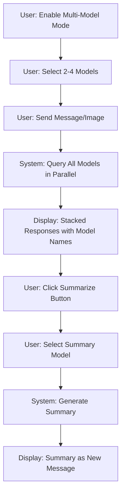

# Multi-Model Query & Summarization Feature Specification

## Overview
This feature allows users to query up to 4 AI models simultaneously and then use a selected model to summarize and synthesize the responses into a comprehensive answer.

## User Experience Flow



## Architecture Design

### Backend Components

#### 1. New Service Method: Multi-Model Query
**File**: `backend/src/services/openRouterService.js`

```javascript
async sendMultiModelRequest(message, image, models, systemPrompt) {
  // Query multiple models in parallel
  // Return array of responses with model info
  // Handle individual model failures gracefully
}
```

**Features**:
- Parallel execution using `Promise.allSettled()` to handle failures
- Max 4 models limit
- Each response includes: model ID, response text, usage stats, success/error status

#### 2. New Service Method: Summarization
**File**: `backend/src/services/openRouterService.js`

```javascript
async summarizeResponses(responses, summaryModel, systemPrompt) {
  // Create summary prompt with all responses
  // Query selected model for summary
  // Return summarized response
}
```

**Features**:
- Auto-generated prompt: "Compare and synthesize these responses into a comprehensive answer"
- Include all model responses in context
- Return summary with metadata

#### 3. New Controller Endpoints
**File**: `backend/src/controllers/chatController.js`

```javascript
exports.sendMultiModelMessage = async (req, res, next) {
  // Handle multi-model requests
  // Validate: 2-4 models required
  // Call openRouterService.sendMultiModelRequest()
}

exports.summarizeResponses = async (req, res, next) {
  // Handle summarization requests
  // Validate: responses array and summary model
  // Call openRouterService.summarizeResponses()
}
```

#### 4. New Routes
**File**: `backend/src/routes/chatRoutes.js`

```javascript
router.post('/chat/multi-model', chatController.sendMultiModelMessage);
router.post('/chat/summarize', chatController.summarizeResponses);
```

### API Endpoints Specification

#### POST `/api/chat/multi-model`
**Request Body**:
```json
{
  "message": "string",
  "image": "base64 string (optional)",
  "models": ["model1", "model2", "model3"],  // 2-4 models
  "systemPrompt": "string (optional)"
}
```

**Response**:
```json
{
  "responses": [
    {
      "model": "google/gemini-pro-vision",
      "response": "text response",
      "usage": { "prompt_tokens": 100, "completion_tokens": 200 },
      "success": true
    },
    {
      "model": "anthropic/claude-3-opus",
      "response": null,
      "error": "Error message",
      "success": false
    }
  ],
  "requestId": "unique-id",
  "timestamp": "ISO-8601"
}
```

#### POST `/api/chat/summarize`
**Request Body**:
```json
{
  "responses": [
    {
      "model": "model1",
      "response": "response text"
    }
  ],
  "summaryModel": "anthropic/claude-3-opus",
  "systemPrompt": "string (optional)"
}
```

**Response**:
```json
{
  "summary": "summarized response text",
  "model": "anthropic/claude-3-opus",
  "usage": { "prompt_tokens": 500, "completion_tokens": 300 }
}
```

### Frontend Components

#### 1. State Management Updates
**File**: `frontend/src/components/ChatInterface.jsx`

**New State Variables**:
```javascript
const [multiModelMode, setMultiModelMode] = useState(false);
const [selectedModels, setSelectedModels] = useState([]);
const [summaryModel, setSummaryModel] = useState('');
const [showSummaryDialog, setShowSummaryDialog] = useState(false);
const [currentMultiModelResponse, setCurrentMultiModelResponse] = useState(null);
```

#### 2. UI Components

**Multi-Model Toggle**:
- Location: Header next to system prompt button
- Enables/disables multi-model mode
- Shows model selection when enabled

**Model Selection UI**:
- Checkboxes for model selection
- Max 4 models enforced
- Validation: minimum 2 models required
- Clear visual indication of selected count

**Stacked Response Display**:
```
┌─────────────────────────────────────┐
│ 🤖 AI Response (Multi-Model)       │
│ ┌─────────────────────────────────┐ │
│ │ 📊 Gemini Pro Vision            │ │
│ │ Response text here...           │ │
│ └─────────────────────────────────┘ │
│ ┌─────────────────────────────────┐ │
│ │ 📊 Claude 3 Opus                │ │
│ │ Response text here...           │ │
│ └─────────────────────────────────┘ │
│ ┌─────────────────────────────────┐ │
│ │ ⚠️  GPT-4 Vision - Error        │ │
│ │ Failed to get response          │ │
│ └─────────────────────────────────┘ │
│                                      │
│ [📝 Summarize]                      │
└─────────────────────────────────────┘
```

**Summary Dialog**:
- Popup/dropdown to select summary model
- Default to best-performing model from the query
- Confirm button to trigger summarization

**Summary Display**:
- Appears as new message in chat
- Marked with "📋 Summary" badge
- Shows which model generated the summary

#### 3. New API Functions
**File**: `frontend/src/services/api.js`

```javascript
export const sendMultiModelMessage = async (message, image, models, systemPrompt) => {
  // POST to /api/chat/multi-model
}

export const summarizeResponses = async (responses, summaryModel, systemPrompt) => {
  // POST to /api/chat/summarize
}
```

## Message Data Structure

### User Message (Multi-Model)
```javascript
{
  id: timestamp,
  role: 'user',
  content: 'message text',
  image: 'base64',
  timestamp: 'ISO-8601',
  multiModel: true,
  selectedModels: ['model1', 'model2']
}
```

### AI Response (Multi-Model)
```javascript
{
  id: timestamp,
  role: 'assistant',
  multiModel: true,
  responses: [
    {
      model: 'model-id',
      modelName: 'Model Name',
      content: 'response text',
      success: true,
      usage: {...}
    }
  ],
  timestamp: 'ISO-8601',
  canSummarize: true
}
```

### AI Response (Summary)
```javascript
{
  id: timestamp,
  role: 'assistant',
  content: 'summary text',
  timestamp: 'ISO-8601',
  isSummary: true,
  summaryModel: 'model-id',
  summaryModelName: 'Model Name',
  sourceResponseId: 'original-multi-model-response-id'
}
```

## CSS Updates

**File**: `frontend/src/components/ChatInterface.css`

New classes needed:
- `.multi-model-toggle` - Toggle switch styling
- `.model-selector` - Checkboxes for model selection
- `.multi-model-response` - Container for stacked responses
- `.individual-response` - Each model's response card
- `.response-error` - Error state styling
- `.btn-summarize` - Summarize button
- `.summary-dialog` - Model selection dialog
- `.summary-message` - Summary message styling
- `.loading-multi` - Loading state for multiple models

## Error Handling

### Backend
1. **Model validation**: Check 2-4 models provided
2. **Partial failures**: Handle when some models fail
3. **Complete failure**: All models fail scenario
4. **Rate limiting**: Handle OpenRouter rate limits
5. **Timeout**: Set reasonable timeout for parallel requests

### Frontend
1. **Model selection**: Enforce 2-4 model limit
2. **Display errors**: Show which models failed with reasons
3. **Graceful degradation**: Allow summarization even if some models failed
4. **Network errors**: Handle connection failures
5. **Loading states**: Show progress for each model

## Performance Considerations

1. **Parallel Requests**: Use `Promise.allSettled()` for true parallelism
2. **Timeout**: Set 45-second timeout for multi-model requests
3. **Caching**: Consider caching model responses (future enhancement)
4. **UI Responsiveness**: Show individual model responses as they come in (future enhancement)
5. **Token Usage**: Display total token usage across all models

## Testing Strategy

### Unit Tests
- Service methods for multi-model queries
- Service methods for summarization
- Controller validation logic
- Frontend state management

### Integration Tests
- End-to-end multi-model query flow
- End-to-end summarization flow
- Error handling scenarios
- API endpoint validation

### Manual Testing
1. Query 2 models successfully
2. Query 4 models successfully
3. Query with 1 model failing, 3 succeeding
4. Query with all models failing
5. Summarize successful responses
6. Test with images
7. Test with text-only queries
8. Test different summary models

## Future Enhancements

1. **Streaming responses**: Show each model's response as it arrives
2. **Response comparison**: Visual diff between model responses
3. **Model preferences**: Save frequently used model combinations
4. **Custom summary prompts**: Allow user-defined summary instructions
5. **Response voting**: Let users rate which model's response was best
6. **Export**: Export multi-model comparison results
7. **Statistics**: Track which models perform best for different queries

## Implementation Priority

### Phase 1 (MVP)
1. Backend multi-model service method
2. Backend summarization service method
3. API endpoints
4. Basic frontend UI (toggle, model selection)
5. Stacked response display
6. Basic summarization

### Phase 2 (Enhancements)
1. Better error handling
2. Loading state improvements
3. CSS polish
4. Documentation

### Phase 3 (Future)
1. Streaming responses
2. Advanced features listed above

## Security Considerations

1. **API Key**: Ensure OpenRouter API key is secured
2. **Rate limiting**: Implement on multi-model endpoint
3. **Input validation**: Sanitize all inputs
4. **Model access**: Only allow authorized models
5. **Response size**: Limit response sizes to prevent abuse

## Configuration Updates

**File**: `backend/src/config.js`

Add:
```javascript
multiModel: {
  maxModels: 4,
  minModels: 2,
  timeout: 45000, // 45 seconds
  defaultSummaryPrompt: 'Compare and synthesize these responses into a comprehensive answer'
}