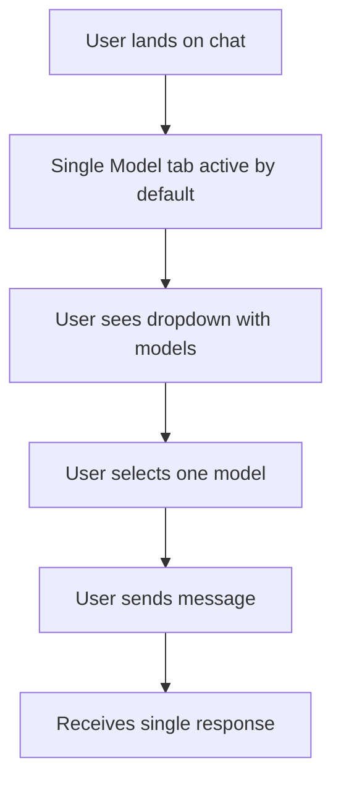
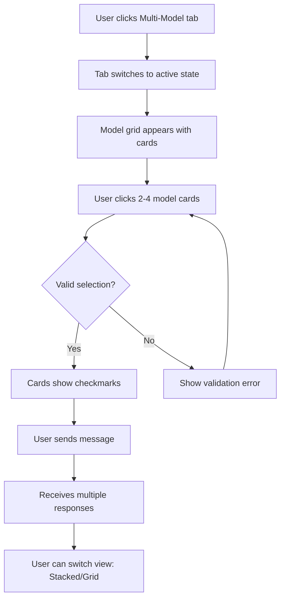

# Multi-Model Interface UI Redesign Specification

## Executive Summary

This document outlines the complete redesign of the multi-model interface to address critical UX issues and improve user understanding and experience.

## Current Problems Identified

### 1. Confusing Layout
- Model selector appears/disappears causing jarring layout shifts
- Users lose context when switching modes
- No visual continuity between single and multi-model states

### 2. Poor Mode Indication
- Not immediately clear which mode is active
- Multi-model toggle button doesn't stand out
- No persistent visual reminder of current mode

### 3. Unintuitive Model Selection
- React-Select dropdown is not obvious for multiple selections
- Users don't understand they can select multiple models
- No visual indication of how many models they've selected at a glance
- No clear guidance on the 2-4 model requirement

### 4. Misplaced Controls
- View toggle (Stacked/Side-by-Side) appears inside each message
- Should be a global preference, not per-message
- Creates confusion about what the controls affect

### 5. CSS Syntax Error
- Extra closing brace at line 796 in ChatInterface.css
- Breaking the stylesheet and causing rendering issues

### 6. Weak Visual Hierarchy
- Selected models blend in with the UI
- No color distinction between modes
- Important information not prominently displayed

---

## Design Solution: Unified Header with Tabs

### Visual Mockup

```
┌─────────────────────────────────────────────────────────────────────┐
│ 🤖 AI Chat Assistant                                                │
│                                                                       │
│ ┌────────────────┬──────────────────┐                               │
│ │  Single Model  │ Multi-Model (2-4)│  [📋 System Prompt] [⚙️]     │
│ └────────────────┴──────────────────┘                               │
├───────────────────────────────────────────────────────────────────────┤
│ 📱 Mode: Single Model                                                │
│                                                                       │
│ Select AI Model:                                                     │
│ ┌─────────────────────────────────────────────────────────────────┐ │
│ │ [▼] google/gemini-pro-vision                                    │ │
│ └─────────────────────────────────────────────────────────────────┘ │
└───────────────────────────────────────────────────────────────────────┘
```

```
┌─────────────────────────────────────────────────────────────────────┐
│ 🤖 AI Chat Assistant                                                │
│                                                                       │
│ ┌────────────────┬──────────────────┐                               │
│ │  Single Model  │ Multi-Model (2-4)│  [📋 System Prompt] [⚙️]     │
│ └────────────────┴──────────────────┘                               │
├───────────────────────────────────────────────────────────────────────┤
│ 🔀 Mode: Multi-Model Compare         View: [📚 Stacked] [⇄ Grid]    │
│                                                                       │
│ Select Models (2-4): 2 selected                                      │
│ ┌────────────┐ ┌────────────┐ ┌────────────┐ ┌────────────┐        │
│ │ ✓ Gemini   │ │ ✓ Claude   │ │   GPT-4    │ │  Llama 3   │        │
│ │    Pro     │ │  3 Opus    │ │   Vision   │ │   70B      │        │
│ └────────────┘ └────────────┘ └────────────┘ └────────────┘        │
│                                                                       │
│ 💡 Tip: Select 2-4 models to compare their responses                │
└───────────────────────────────────────────────────────────────────────┘
```

---

## Component Architecture Changes

### 1. Header Structure Redesign

**New Layout Hierarchy:**

```jsx
<header className="chat-header">
  <div className="header-top">
    <h1>🤖 AI Chat Assistant</h1>
    <div className="header-actions">
      <button className="btn-system-prompt">📋 System Prompt</button>
      <button className="btn-settings">⚙️</button>
    </div>
  </div>
  
  <div className="mode-selector">
    <button className={`mode-tab ${!multiModelMode ? 'active' : ''}`}>
      Single Model
    </button>
    <button className={`mode-tab ${multiModelMode ? 'active' : ''}`}>
      Multi-Model (2-4)
    </button>
  </div>
</header>

<div className="model-selector-panel">
  {/* Content changes based on mode */}
  {!multiModelMode && <SingleModelSelector />}
  {multiModelMode && <MultiModelSelector />}
</div>
```

### 2. Single Model Selector Component

**Simple dropdown (current behavior)**
```jsx
<div className="single-model-section">
  <div className="section-header">
    <span className="mode-indicator">📱 Mode: Single Model</span>
  </div>
  <label htmlFor="model-select">Select AI Model:</label>
  <select id="model-select" className="model-dropdown">
    {/* Model options */}
  </select>
</div>
```

### 3. Multi-Model Selector Component

**Visual card grid instead of dropdown**
```jsx
<div className="multi-model-section">
  <div className="section-header">
    <span className="mode-indicator">🔀 Mode: Multi-Model Compare</span>
    <div className="view-controls">
      <span className="view-label">View:</span>
      <button className={`btn-view-mode ${compareView === 'stacked' ? 'active' : ''}`}>
        📚 Stacked
      </button>
      <button className={`btn-view-mode ${compareView === 'side-by-side' ? 'active' : ''}`}>
        ⇄ Grid
      </button>
    </div>
  </div>
  
  <label>
    Select Models (2-4): 
    <span className="selection-count">{selectedModels.length} selected</span>
  </label>
  
  <div className="model-grid">
    {models.map(model => (
      <button
        key={model.id}
        className={`model-card ${selectedModels.includes(model.id) ? 'selected' : ''}`}
        onClick={() => handleModelToggle(model.id)}
      >
        <div className="model-card-header">
          {selectedModels.includes(model.id) && <span className="check-icon">✓</span>}
        </div>
        <div className="model-card-name">{model.name}</div>
      </button>
    ))}
  </div>
  
  <p className="helper-text">
    💡 Tip: Select 2-4 models to compare their responses
  </p>
</div>
```

---

## CSS Architecture

### 1. Color Scheme

```css
:root {
  /* Primary Colors */
  --primary-gradient: linear-gradient(135deg, #667eea 0%, #764ba2 100%);
  --primary-color: #667eea;
  --primary-dark: #764ba2;
  
  /* Mode Colors */
  --single-mode-color: #3b82f6;
  --multi-mode-color: #8b5cf6;
  
  /* Status Colors */
  --success-color: #10b981;
  --error-color: #ef4444;
  --warning-color: #f59e0b;
  
  /* Neutral Colors */
  --bg-primary: #ffffff;
  --bg-secondary: #f8f9fa;
  --bg-tertiary: #f3f4f6;
  --border-color: #e5e7eb;
  --text-primary: #1f2937;
  --text-secondary: #6b7280;
  --text-muted: #9ca3af;
  
  /* Spacing */
  --spacing-xs: 0.25rem;
  --spacing-sm: 0.5rem;
  --spacing-md: 1rem;
  --spacing-lg: 1.5rem;
  --spacing-xl: 2rem;
  
  /* Border Radius */
  --radius-sm: 4px;
  --radius-md: 8px;
  --radius-lg: 12px;
  --radius-xl: 16px;
  --radius-full: 9999px;
  
  /* Shadows */
  --shadow-sm: 0 1px 2px 0 rgba(0, 0, 0, 0.05);
  --shadow-md: 0 4px 6px -1px rgba(0, 0, 0, 0.1);
  --shadow-lg: 0 10px 15px -3px rgba(0, 0, 0, 0.1);
  --shadow-xl: 0 20px 25px -5px rgba(0, 0, 0, 0.1);
}
```

### 2. Header Redesign

```css
.chat-header {
  background: var(--primary-gradient);
  color: white;
  padding: var(--spacing-lg);
  box-shadow: var(--shadow-md);
}

.header-top {
  display: flex;
  justify-content: space-between;
  align-items: center;
  margin-bottom: var(--spacing-md);
}

.header-top h1 {
  margin: 0;
  font-size: 1.75rem;
  font-weight: 600;
}

.header-actions {
  display: flex;
  gap: var(--spacing-sm);
}

.mode-selector {
  display: flex;
  gap: var(--spacing-xs);
  background: rgba(255, 255, 255, 0.15);
  padding: var(--spacing-xs);
  border-radius: var(--radius-lg);
  backdrop-filter: blur(10px);
}

.mode-tab {
  flex: 1;
  padding: var(--spacing-sm) var(--spacing-lg);
  border: none;
  border-radius: var(--radius-md);
  background: transparent;
  color: rgba(255, 255, 255, 0.8);
  font-size: 0.95rem;
  font-weight: 600;
  cursor: pointer;
  transition: all 0.3s ease;
  white-space: nowrap;
}

.mode-tab:hover {
  background: rgba(255, 255, 255, 0.2);
  color: white;
}

.mode-tab.active {
  background: white;
  color: var(--primary-color);
  box-shadow: var(--shadow-md);
}
```

### 3. Model Selector Panel

```css
.model-selector-panel {
  background: var(--bg-secondary);
  border-bottom: 1px solid var(--border-color);
  padding: var(--spacing-lg);
  transition: all 0.3s ease;
}

.section-header {
  display: flex;
  justify-content: space-between;
  align-items: center;
  margin-bottom: var(--spacing-md);
}

.mode-indicator {
  display: inline-flex;
  align-items: center;
  gap: var(--spacing-sm);
  font-weight: 600;
  font-size: 1rem;
  color: var(--text-primary);
  padding: var(--spacing-sm) var(--spacing-md);
  background: white;
  border-radius: var(--radius-lg);
  box-shadow: var(--shadow-sm);
}

.view-controls {
  display: flex;
  align-items: center;
  gap: var(--spacing-sm);
}

.view-label {
  font-size: 0.9rem;
  color: var(--text-secondary);
  font-weight: 500;
}

.btn-view-mode {
  padding: var(--spacing-sm) var(--spacing-md);
  border: 2px solid var(--border-color);
  border-radius: var(--radius-md);
  background: white;
  color: var(--text-secondary);
  font-size: 0.875rem;
  font-weight: 600;
  cursor: pointer;
  transition: all 0.2s ease;
}

.btn-view-mode:hover {
  border-color: var(--primary-color);
  color: var(--primary-color);
}

.btn-view-mode.active {
  background: var(--primary-gradient);
  color: white;
  border-color: var(--primary-color);
}
```

### 4. Model Grid (Multi-Model)

```css
.model-grid {
  display: grid;
  grid-template-columns: repeat(auto-fill, minmax(140px, 1fr));
  gap: var(--spacing-md);
  margin: var(--spacing-md) 0;
}

.model-card {
  position: relative;
  display: flex;
  flex-direction: column;
  align-items: center;
  padding: var(--spacing-lg);
  background: white;
  border: 2px solid var(--border-color);
  border-radius: var(--radius-lg);
  cursor: pointer;
  transition: all 0.3s ease;
  min-height: 100px;
}

.model-card:hover {
  border-color: var(--primary-color);
  box-shadow: var(--shadow-md);
  transform: translateY(-2px);
}

.model-card.selected {
  border-color: var(--primary-color);
  background: linear-gradient(135deg, rgba(102, 126, 234, 0.1) 0%, rgba(118, 75, 162, 0.1) 100%);
  box-shadow: var(--shadow-lg);
}

.model-card-header {
  position: absolute;
  top: var(--spacing-sm);
  right: var(--spacing-sm);
  width: 24px;
  height: 24px;
  display: flex;
  align-items: center;
  justify-content: center;
}

.check-icon {
  display: flex;
  align-items: center;
  justify-content: center;
  width: 24px;
  height: 24px;
  background: var(--primary-gradient);
  color: white;
  border-radius: var(--radius-full);
  font-size: 0.875rem;
  font-weight: bold;
  box-shadow: var(--shadow-md);
}

.model-card-name {
  font-weight: 600;
  font-size: 0.9rem;
  color: var(--text-primary);
  text-align: center;
  margin-top: var(--spacing-sm);
}

.model-card.selected .model-card-name {
  color: var(--primary-color);
}

.selection-count {
  display: inline-block;
  margin-left: var(--spacing-sm);
  padding: var(--spacing-xs) var(--spacing-md);
  background: var(--primary-gradient);
  color: white;
  border-radius: var(--radius-full);
  font-size: 0.875rem;
  font-weight: 600;
}

.helper-text {
  margin: var(--spacing-md) 0 0 0;
  padding: var(--spacing-md);
  background: rgba(102, 126, 234, 0.1);
  border-left: 4px solid var(--primary-color);
  border-radius: var(--radius-md);
  font-size: 0.875rem;
  color: var(--text-secondary);
  font-style: italic;
}
```

### 5. Enhanced Response Display

```css
/* Remove view controls from individual messages */
.message.assistant.multi-model .compare-controls {
  display: none; /* Moved to header */
}

/* Improve multi-model response container */
.multi-model-responses {
  width: 100%;
  margin-top: var(--spacing-md);
  gap: var(--spacing-lg);
}

.multi-model-responses.stacked {
  display: flex;
  flex-direction: column;
}

.multi-model-responses.side-by-side {
  display: grid;
  grid-template-columns: repeat(auto-fit, minmax(320px, 1fr));
}

.individual-response {
  background: white;
  border-radius: var(--radius-lg);
  padding: var(--spacing-lg);
  box-shadow: var(--shadow-md);
  border-left: 4px solid var(--primary-color);
  transition: all 0.3s ease;
}

.individual-response:hover {
  box-shadow: var(--shadow-lg);
  transform: translateY(-2px);
}

.individual-response.success {
  border-left-color: var(--success-color);
}

.individual-response.error {
  border-left-color: var(--error-color);
  background: rgba(239, 68, 68, 0.05);
}

.response-header {
  display: flex;
  justify-content: space-between;
  align-items: center;
  margin-bottom: var(--spacing-md);
  padding-bottom: var(--spacing-sm);
  border-bottom: 2px solid var(--border-color);
}

.response-model {
  display: flex;
  align-items: center;
  gap: var(--spacing-sm);
  font-weight: 700;
  font-size: 1rem;
  color: var(--text-primary);
}

.individual-response.success .response-model {
  color: var(--success-color);
}

.individual-response.error .response-model {
  color: var(--error-color);
}
```

---

## Responsive Design Improvements

### Mobile Layout (< 768px)

```css
@media (max-width: 768px) {
  .header-top {
    flex-direction: column;
    gap: var(--spacing-md);
    align-items: flex-start;
  }
  
  .header-top h1 {
    font-size: 1.5rem;
  }
  
  .header-actions {
    width: 100%;
    justify-content: flex-end;
  }
  
  .mode-selector {
    width: 100%;
  }
  
  .mode-tab {
    font-size: 0.875rem;
    padding: var(--spacing-sm);
  }
  
  .model-grid {
    grid-template-columns: repeat(auto-fill, minmax(120px, 1fr));
    gap: var(--spacing-sm);
  }
  
  .model-card {
    padding: var(--spacing-md);
    min-height: 80px;
  }
  
  .model-card-name {
    font-size: 0.8rem;
  }
  
  .section-header {
    flex-direction: column;
    align-items: flex-start;
    gap: var(--spacing-sm);
  }
  
  .view-controls {
    width: 100%;
  }
  
  .btn-view-mode {
    flex: 1;
    font-size: 0.8rem;
  }
  
  .multi-model-responses.side-by-side {
    grid-template-columns: 1fr;
  }
}
```

### Tablet Layout (768px - 1024px)

```css
@media (min-width: 768px) and (max-width: 1024px) {
  .model-grid {
    grid-template-columns: repeat(auto-fill, minmax(160px, 1fr));
  }
  
  .multi-model-responses.side-by-side {
    grid-template-columns: repeat(auto-fit, minmax(280px, 1fr));
  }
}
```

---

## Implementation Steps

### Step 1: Fix CSS Syntax Error
- Remove extra closing brace at line 796 in `ChatInterface.css`
- Validate CSS syntax

### Step 2: Update Header Structure
- Add new header layout with tabs
- Implement mode selector component
- Add header action buttons

### Step 3: Create Model Selector Components
- Build SingleModelSelector component
- Build MultiModelSelector with card grid
- Add selection logic

### Step 4: Move View Controls
- Remove view controls from individual messages
- Add view controls to multi-model section header
- Make compareView state persistent

### Step 5: Update CSS
- Add all new CSS classes and variables
- Remove old conflicting styles
- Test responsive breakpoints

### Step 6: Enhance Visual Feedback
- Add mode indicators
- Add selection counts
- Add helper text
- Improve color coding

### Step 7: Test & Refine
- Test mode switching
- Test model selection
- Test view switching
- Test mobile responsiveness
- Validate accessibility

---

## User Flow Diagrams

### Single Model Flow


### Multi-Model Flow


---

## Accessibility Considerations

1. **Keyboard Navigation**
   - Tab through mode selector
   - Arrow keys to navigate model cards
   - Enter/Space to select models
   - Focus indicators on all interactive elements

2. **Screen Readers**
   - Proper ARIA labels on all buttons
   - Announce mode changes
   - Announce model selection counts
   - Describe card states (selected/unselected)

3. **Color Contrast**
   - Ensure WCAG AA compliance
   - Don't rely solely on color for information
   - Use icons + text for status

4. **Focus Management**
   - Trap focus in modal dialogs
   - Return focus appropriately
   - Visible focus indicators

---

## Performance Optimizations

1. **Lazy Loading**
   - Load model cards only when needed
   - Defer non-critical CSS

2. **Memoization**
   - Memoize model grid component
   - Prevent unnecessary re-renders

3. **Debouncing**
   - Debounce model selection changes
   - Optimize API calls

---

## Testing Checklist

### Functional Testing
- [ ] Mode switching works correctly
- [ ] Single model selection works
- [ ] Multi-model selection (2-4 models)
- [ ] Validation errors show correctly
- [ ] View preference persists
- [ ] Responses display correctly in both views
- [ ] CSS syntax is valid

### Visual Testing
- [ ] Layout doesn't shift when switching modes
- [ ] Colors match design spec
- [ ] Icons display correctly
- [ ] Responsive on mobile (< 768px)
- [ ] Responsive on tablet (768-1024px)
- [ ] Responsive on desktop (> 1024px)

### Accessibility Testing
- [ ] Keyboard navigation works
- [ ] Screen reader announces changes
- [ ] Color contrast meets WCAG AA
- [ ] Focus management is correct

### Browser Testing
- [ ] Chrome
- [ ] Firefox
- [ ] Safari
- [ ] Edge

---

## Migration Notes

### Breaking Changes
- React-Select dependency can be removed
- Compare view controls moved from messages to header
- Model selector structure completely changed

### Data Migration
- No data migration needed
- State structure remains compatible
- Existing messages will render correctly

---

## Future Enhancements

1. **Model Descriptions**
   - Add tooltips with model capabilities
   - Show pricing information
   - Display performance metrics

2. **Preset Combinations**
   - Save favorite model combinations
   - Quick-select presets
   - Share combinations

3. **Advanced Filtering**
   - Filter models by capability (vision, coding, etc.)
   - Sort by performance, price, speed
   - Search models

4. **Visual Diff**
   - Side-by-side comparison with highlighting
   - Show differences between responses
   - Export comparison

---

## Summary

This redesign addresses all identified UX issues:

✅ **Fixed Layout Shifts** - Tabs maintain consistent position
✅ **Clear Mode Indication** - Prominent tabs and mode indicators  
✅ **Intuitive Model Selection** - Visual cards instead of dropdown
✅ **Proper Control Placement** - View controls in header, not messages
✅ **CSS Syntax Fixed** - Removed extra closing brace
✅ **Strong Visual Hierarchy** - Clear color coding and typography

The new design provides a clearer, more intuitive experience that helps users understand the multi-model feature and use it effectively.